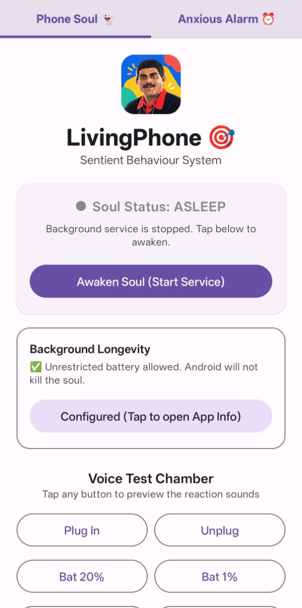
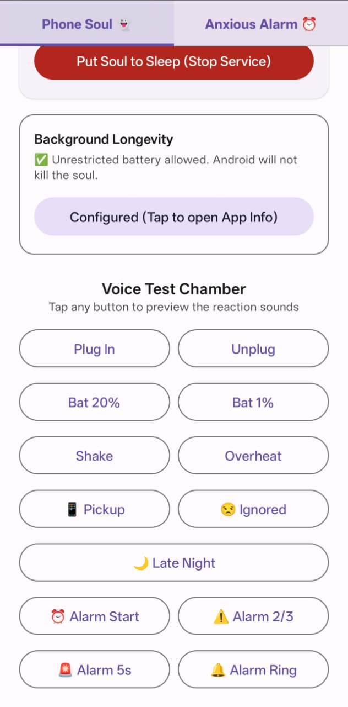
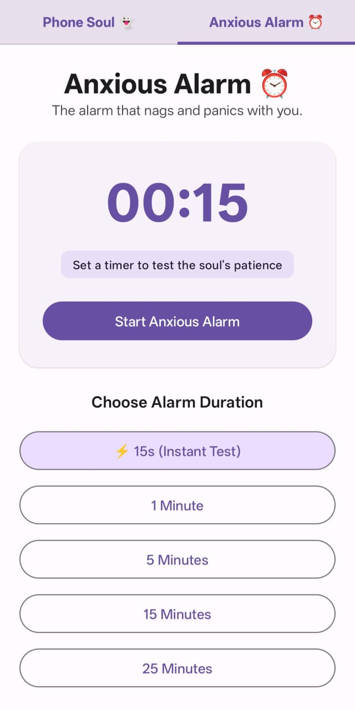
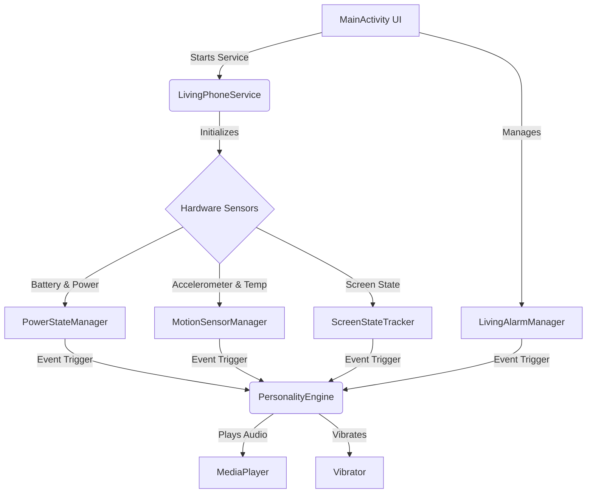

# LivingPhone


## Basic Details
### Team Name: Cookies


### Team Members
- Member 1: Muhammed Risvan - AISAT
- Member 2: Atheendradev CV - AISAT

### Project Description
LivingPhone turns your Android device into a dramatic, sentient companion that reacts to how you treat it. It complains in iconic Malayalam dialogues during low battery, reacts to physical drops and shakes, nags you for late-night scrolling, and hypes you up with an anxious countdown alarm.

### The Problem (that doesn't exist)
Some people (or perhaps just me) don't really glance at their battery percentage, leading to sticky situations when you urgently need your phone but it's nearly dead... completely your own fault for being irresponsible, btw.

### The Solution (that nobody asked for)
Your phone gets a full-blown attitude upgrade powered by iconic Malayalam movie dialogues! It dramatically panics as the battery drains (20%, 10%, 5%, 1%), guilt-trips you when you leave it ignored for 10 seconds, roasts you for waking it up past 11 PM, and panics along with you using high-stakes anxious countdown alarms.

## Technical Details
### Technologies/Components Used
For Software:
- Languages: Kotlin, XML
- Frameworks: Android SDK (API 34), Jetpack Compose
- Libraries:
  - Jetpack Compose Material 3 (UI & Animations)
  - AndroidX Core KTX & Lifecycle Runtime KTX
  - AndroidX Activity Compose
  - Android Sensor Framework (SensorManager, Accelerometer/Gyroscope APIs)
  - Android Media Framework (MediaPlayer for real-time audio triggers)
- Tools: Android Studio, Gradle, Git, GitHub

# Installation
### Option A: Quick Install (Direct APK - No setup required)
1. Download the latest [**LivingPhone.apk**](https://github.com/risvandev/Cookies/releases/download/v1.0.0/LivingPhone.apk) from the [v1.0.0 Release](https://github.com/risvandev/Cookies/releases/latest).
2. Open the downloaded APK on your Android device.
3. Allow "Install from unknown sources" if prompted, then tap **Install**.

### Option B: Build from Source (Developers)
**Prerequisites:**
- Android Studio (Koala / Ladybug or newer)
- JDK 17+ and Android SDK (API 34)

```bash
git clone https://github.com/risvandev/Cookies.git
cd Cookies
```

# Run
### For Regular Users:
1. Open the **LivingPhone** app from your app drawer.
2. Grant notification and battery optimization exemption permissions when prompted so the background soul can run smoothly.
3. Tap **Start Phone Soul** or head over to **Anxious Alarm**!

### For Developers:
1. Open the cloned folder in **Android Studio**.
2. Wait for Gradle sync to complete.
3. Connect your Android device (or launch an Emulator) and click **Run** (`Shift + F10`), or generate the APK from **Build > Build Bundle(s) / APK(s) > Build APK(s)**.

# Screenshots
<p align="center">
  
  
  
</p>

# Diagrams

*LivingPhone Architecture: UI and background sensors feed events into the PersonalityEngine to trigger dramatic audio reactions.*

### Project Demo
# Video
[Add your demo video link here]
*Explain what the video demonstrates*

# Additional Demos
[Add any extra demo materials/links]

## Team Contributions
- Muhammed Risvan: Built the app - directed the technical implementation and tested.
- Atheendradev CV: Shaped the comedic identity — selected the Malayalam dialogues, and wrote the documentation.

---
Made with ❤️ at TinkerHub Useless Projects 


